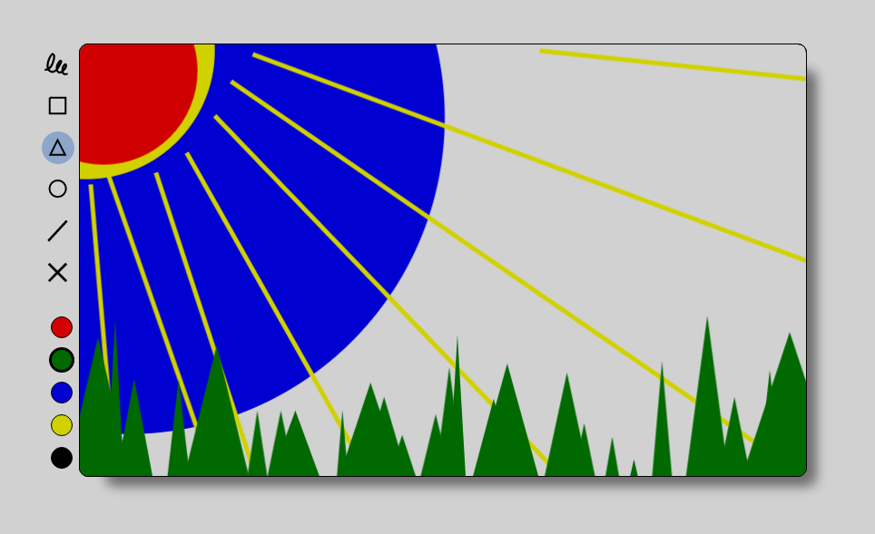
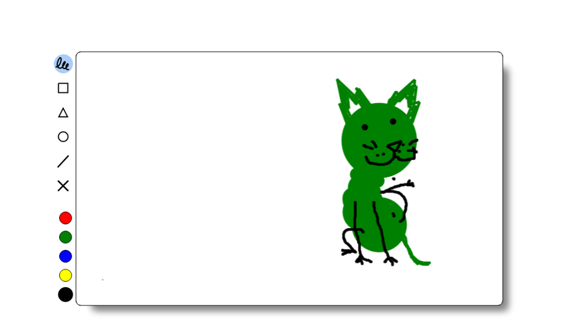

# JavaScript-UI-DOM-Team-Perseus
Team Work for JavaScript UI &amp; DOM (March 2017)
<html>
    <body>
    
This is a simple Paint-like app

    
You can draw freely or you can use the shapes.

    <ul> Available tools: 
    <li>Free drawing</li>
        <li>Triangle</li>
        <li>Square</li>
        <li>Circle</li>
        <li>Line</li>
        <li>Clear canvas</li>
        <li>Different colors</li>
    </ul>
    <ul> We've used:
        <li>HTML</li>
        <li>CSS</li>
        <li>JavaScript</li>
        <li>jQuery</li>
        <li>Handlebars</li>
        <li>Canvas</li>
        <li>SVG</li>
        <li>Fabric Js</li>    
    </ul>
    
The app is written using ES6 syntax and is OOP based. More controls and colors can be added dynamically. 
    Controls are animated upon page load.

    
    
    </body>
</html>

# Team

Name | TelerikAcademy user | GitHub user
-----|-------|-------
Кристиян Николов | Dawnut | Dawnut
Найден Момински | Nayden_mominski | NaydenMominski
Цветомир Дочев | Tdochev | tdochev
Николай Цветин | Cvetinn | NikolayTsvetin
Ангел Язаров | Angel1985 | angel75013
Димитър Несторов | dimitarnestorov | dimitarnestorov
Емил Димитров | qwerty123 | EmilPD
